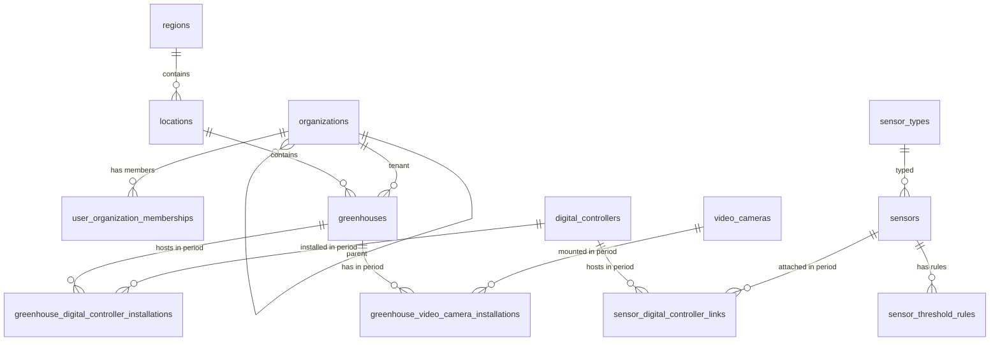

# Структура БД `CNT_GM_DB` (метаданные)

## Назначение и границы

`CNT_GM_DB` хранит **справочники и метаданные** системы greenhouse-monitoring (PostgreSQL), в соответствии с [ADR-0003](../../../adr/0003-use-postgres.md):

- **организации** и **связь пользователь ↔ организация** (доступ к теплицам через членство);
- теплицы и их иерархия расположения;
- типы датчиков и **отдельные экземпляры**: датчик (`sensors`), цифровой контроллер (`digital_controllers`), видеокамера (`video_cameras`);
- **периоды привязок** с полями **`sdate`** / **`edate`** (дата начала / окончания интервала; `edate = NULL` — интервал открыт): датчик ↔ контроллер, контроллер ↔ теплица, видеокамера ↔ теплица;
- конфигурация порогов событий;
- служебные связи для API.

Что **не хранится** в этой БД:

- телеметрия временных рядов датчиков (она в `CNT_GM_Timeseries_DB` / ClickHouse);
- учётные записи, пароли и токены OIDC (они в `CNT_GM_Identity_DB`); в метаданных хранится только **`user_id`**, совпадающий с **`sub`** / PK пользователя в Identity (логическая ссылка без FK между базами).

---

## Соглашения и типы

- СУБД: PostgreSQL.
- Именование: `snake_case`, таблицы во множественном числе (см. [psql-naming-conventions](../../../../standards/psql-naming-conventions.md)).
- Рекомендуемая схема: `app`.
- PK: **`uuid`** для всех сущностей домена (организации, теплицы, датчики, камеры, правила и т.д.); публичный REST описан в [gm_openapi.yaml](../../openapi/components/gm_openapi.yaml) с тем же типом идентификаторов в путях и JSON.
- Время: `timestamptz`.

---

## Логическая ER-модель

---

## 1) Организации и членство пользователей

### `organizations`

Справочник организаций (юридические/операционные единицы). Иерархия опциональна (`parent_id`).

| Поле | Тип | Описание |
|------|-----|----------|
| `id` | `uuid` | PK организации. |
| `code` | `varchar(64)` | Уникальный короткий код (интеграции, UI). |
| `name` | `varchar(512)` | Наименование. |
| `parent_id` | `uuid` | FK → `organizations.id`; `NULL` — корень. |
| `description` | `text` | Описание. |
| `is_active` | `boolean` | Активность записи. |
| `created_at` | `timestamptz` | Создание. |
| `updated_at` | `timestamptz` | Обновление. |

Индексы: `idx_organizations_code` (unique), `idx_organizations_parent_id`.

### `user_organization_memberships`

Связь учётной записи Identity с организацией. **`user_id`** — тот же идентификатор, что **`sub`** в access token (и PK в `asp_net_users`), тип **`uuid`** при `IdentityUser<Guid>`.

| Поле | Тип | Описание |
|------|-----|----------|
| `id` | `uuid` | Суррогатный PK. |
| `user_id` | `uuid` | Идентификатор пользователя в Identity (**без FK** между БД). |
| `organization_id` | `uuid` | FK → `organizations.id`. |
| `is_primary` | `boolean` | Основная организация в UI (не более одной активной на пользователя — контроль в приложении или частичный уникальный индекс). |
| `title` | `varchar(256)` | Должность в организации. |
| `membership_role` | `varchar(64)` | Роль в организации (`org_admin`, `member`, …). |
| `status` | `varchar(32)` | `active`, `invited`, `suspended`, … |
| `joined_at` | `timestamptz` | Начало членства. |
| `left_at` | `timestamptz` | Окончание; `NULL` — действующее. |
| `created_at` | `timestamptz` | Создание записи. |
| `updated_at` | `timestamptz` | Обновление записи. |

Ограничения: частичный уникальный индекс на `(user_id, organization_id)` при `left_at IS NULL`.  
Индексы: `idx_user_organization_memberships_user_id`, `idx_user_organization_memberships_organization_id`.

---

## 2) Локации и теплицы

### `regions`

| Поле | Тип | Описание |
|------|-----|----------|
| `id` | `uuid` | PK региона. |
| `code` | `varchar(32)` | Уникальный код региона. |
| `name` | `varchar(256)` | Наименование региона. |
| `is_active` | `boolean` | Активность записи. |
| `created_at` | `timestamptz` | Дата создания. |
| `updated_at` | `timestamptz` | Дата обновления. |

Индексы: `idx_regions_code` (unique), `idx_regions_name`.

### `locations`

| Поле | Тип | Описание |
|------|-----|----------|
| `id` | `uuid` | PK локации. |
| `region_id` | `uuid` | FK -> `regions.id`. |
| `code` | `varchar(32)` | Уникальный код внутри региона. |
| `name` | `varchar(256)` | Наименование площадки/локации. |
| `address` | `varchar(512)` | Адрес. |
| `latitude` | `numeric(9,6)` | Геопозиция (широта). |
| `longitude` | `numeric(9,6)` | Геопозиция (долгота). |
| `is_active` | `boolean` | Активность. |
| `created_at` | `timestamptz` | Дата создания. |
| `updated_at` | `timestamptz` | Дата обновления. |

Индексы: `idx_locations_region_id`, `idx_locations_code_region` (unique on `region_id, code`).

### `greenhouses`

| Поле | Тип | Описание |
|------|-----|----------|
| `id` | `uuid` | PK теплицы. |
| `organization_id` | `uuid` | FK -> `organizations.id`. Владелец/арендатор теплицы; фильтр «свои теплицы» через `user_organization_memberships`. |
| `location_id` | `uuid` | FK -> `locations.id`. |
| `code` | `varchar(32)` | Уникальный код теплицы. |
| `name` | `varchar(256)` | Отображаемое имя. |
| `area_m2` | `numeric(10,2)` | Площадь (м2), опционально. |
| `timezone` | `varchar(64)` | Таймзона (например `Europe/Moscow`). |
| `is_active` | `boolean` | Активность теплицы. |
| `commissioned_at` | `date` | Дата ввода в эксплуатацию. |
| `created_at` | `timestamptz` | Дата создания. |
| `updated_at` | `timestamptz` | Дата обновления. |

Индексы: `idx_greenhouses_organization_id`, `idx_greenhouses_location_id`, уникальность кода теплицы в рамках организации: `idx_greenhouses_org_code` (unique on `organization_id`, `code`).

---

## 3) Типы датчиков

### `sensor_types`

| Поле | Тип | Описание |
|------|-----|----------|
| `id` | `uuid` | PK типа датчика. |
| `code` | `varchar(64)` | Уникальный код типа (`temperature`, `humidity`, `soil_ph`). |
| `name` | `varchar(256)` | Наименование типа. |
| `default_unit` | `varchar(16)` | Базовая единица измерения (`C`, `%`, `pH`). |
| `value_min` | `numeric(12,4)` | Физически допустимый минимум. |
| `value_max` | `numeric(12,4)` | Физически допустимый максимум. |
| `is_active` | `boolean` | Активность. |
| `created_at` | `timestamptz` | Дата создания. |
| `updated_at` | `timestamptz` | Дата обновления. |

Индексы: `idx_sensor_types_code` (unique).

---

## 4) Экземпляры оборудования (датчик, контроллер, видеокамера)

Ниже три **независимых** справочника экземпляров. Привязка к теплице и связь «датчик — контроллер» задаётся **отдельными** таблицами периодов (раздел 5) с полями **`sdate`** / **`edate`**.

### `digital_controllers`

Экземпляр **цифрового контроллера** на объекте (edge), публикующий телеметрию по MQTT.

| Поле | Тип | Описание |
|------|-----|----------|
| `id` | `uuid` | PK экземпляра контроллера. |
| `code` | `varchar(64)` | Внутренний код устройства (интеграции, UI). |
| `display_name` | `varchar(256)` | Отображаемое имя. |
| `is_active` | `boolean` | Учётная активность записи. |
| `created_at` | `timestamptz` | Дата создания. |
| `updated_at` | `timestamptz` | Дата обновления. |

Индексы: `idx_digital_controllers_code` (unique, если `code` глобально уникален; иначе — по политике организации/площадки).

### `sensors`

Экземпляр **датчика** (логический/физический узел измерения), без прямой привязки к теплице в этой таблице.

| Поле | Тип | Описание |
|------|-----|----------|
| `id` | `uuid` | PK экземпляра датчика. |
| `sensor_type_id` | `uuid` | FK -> `sensor_types.id`. |
| `display_name` | `varchar(256)` | Имя для UI. |
| `install_position` | `varchar(128)` | Место установки (опционально). |
| `is_active` | `boolean` | Учётная активность. |
| `created_at` | `timestamptz` | Дата создания. |
| `updated_at` | `timestamptz` | Дата обновления. |

Индексы: `idx_sensors_sensor_type_id`.

### `video_cameras`

Экземпляр **IP-видеокамеры** (источник RTSP и т.п.). Привязка к теплице — только через `greenhouse_video_camera_installations`.

| Поле | Тип | Описание |
|------|-----|----------|
| `id` | `uuid` | PK экземпляра камеры. |
| `camera_code` | `varchar(64)` | Уникальный код камеры в интеграции (go2rtc, UI). |
| `name` | `varchar(256)` | Наименование камеры. |
| `stream_profile` | `varchar(64)` | Профиль потока по умолчанию (`main`, `sub`, и т.п.). |
| `is_active` | `boolean` | Учётная активность. |
| `created_at` | `timestamptz` | Дата создания. |
| `updated_at` | `timestamptz` | Дата обновления. |

Индексы: `idx_video_cameras_camera_code` (unique).

---

## 5) Периоды привязок (`sdate` / `edate`)

Поля **`sdate`** и **`edate`** — границы интервала (**включительно** по смыслу периода; уточнение «закрытый/полуоткрытый» интервал — в приложении). **`edate`** может быть **`NULL`**: привязка действует с `sdate` без заранее заданного окончания.

### `greenhouse_digital_controller_installations`

Установка **контроллера** на **теплицу** в заданный период (где физически обслуживается объект).

| Поле | Тип | Описание |
|------|-----|----------|
| `id` | `uuid` | PK строки установки. |
| `digital_controller_id` | `uuid` | FK -> `digital_controllers.id`. |
| `greenhouse_id` | `uuid` | FK -> `greenhouses.id`. |
| `sdate` | `date` | Начало действия привязки контроллера к теплице. |
| `edate` | `date` | Конец действия; `NULL` — открытый интервал. |
| `created_at` | `timestamptz` | Дата создания записи. |
| `updated_at` | `timestamptz` | Дата обновления. |

Индексы: `idx_gdc_install_controller`, `idx_gdc_install_greenhouse`.  
Ограничение целостности (на уровне приложения или exclusion в PostgreSQL): непересекающиеся интервалы для одного `digital_controller_id` (и при необходимости — для пары контроллер–теплица).

### `sensor_digital_controller_links`

Подключение **экземпляра датчика** к **экземпляру контроллера** в заданный период. Здесь же задаётся ключ канала на стороне контроллера.

| Поле | Тип | Описание |
|------|-----|----------|
| `id` | `uuid` | PK связи (удобно для аудита; см. также пороги). |
| `sensor_id` | `uuid` | FK -> `sensors.id`. |
| `digital_controller_id` | `uuid` | FK -> `digital_controllers.id`. |
| `external_sensor_key` | `varchar(128)` | Идентификатор канала/датчика в прошивке контроллера (MQTT payload). |
| `sdate` | `date` | Начало действия подключения датчика к контроллеру. |
| `edate` | `date` | Конец действия; `NULL` — открытый интервал. |
| `created_at` | `timestamptz` | Дата создания. |
| `updated_at` | `timestamptz` | Дата обновления. |

Индексы: `idx_sdc_links_sensor`, `idx_sdc_links_controller`, уникальность активного ключа на контроллере: частичный уникальный индекс на `(digital_controller_id, external_sensor_key)` при открытом интервале или в рамках непересекающихся дат (политика — в приложении).  
Ограничение: в один момент времени один `sensor_id` не должен быть подключён к двум контроллерам (пересечение интервалов).

### `greenhouse_video_camera_installations`

Установка **видеокамеры** на **теплицу** в заданный период.

| Поле | Тип | Описание |
|------|-----|----------|
| `id` | `uuid` | PK строки установки. |
| `video_camera_id` | `uuid` | FK -> `video_cameras.id`. |
| `greenhouse_id` | `uuid` | FK -> `greenhouses.id`. |
| `sdate` | `date` | Начало действия установки камеры на теплице. |
| `edate` | `date` | Конец действия; `NULL` — открытый интервал. |
| `created_at` | `timestamptz` | Дата создания. |
| `updated_at` | `timestamptz` | Дата обновления. |

Индексы: `idx_gvc_install_camera`, `idx_gvc_install_greenhouse`.

**Производная привязка «датчик — теплица»** для заданного момента времени: существуют пересекающиеся по датам записи в `sensor_digital_controller_links` и `greenhouse_digital_controller_installations` с общим `digital_controller_id` (пересечение интервалов `sdate`/`edate`).

---

## 6) Правила порогов для событий

### `sensor_threshold_rules`

Правила для генерации событий в аналитике/поиске (FR-02).

| Поле | Тип | Описание |
|------|-----|----------|
| `id` | `uuid` | PK правила. |
| `sensor_id` | `uuid` | FK -> `sensors.id` (экземпляр датчика). |
| `rule_code` | `varchar(64)` | Код правила (`high_temp`, `low_humidity`). |
| `operator` | `varchar(8)` | Оператор (`>`, `>=`, `<`, `<=`, `between`). |
| `threshold_min` | `numeric(12,4)` | Нижний порог (если применимо). |
| `threshold_max` | `numeric(12,4)` | Верхний порог (если применимо). |
| `severity` | `varchar(16)` | Критичность (`info`, `warning`, `critical`). |
| `is_enabled` | `boolean` | Включено ли правило. |
| `effective_from` | `timestamptz` | Начало действия. |
| `effective_to` | `timestamptz` | Окончание действия. |
| `created_at` | `timestamptz` | Дата создания. |
| `updated_at` | `timestamptz` | Дата обновления. |

Индексы: `idx_sensor_threshold_rules_sensor_id`, `idx_sensor_threshold_rules_enabled`.

---

## Связи с другими БД

### Связь с `CNT_GM_Timeseries_DB` (ClickHouse)

- Временные ряды хранят только `sensor_id`, `greenhouse_id`, `metric_code`.
- `sensor_id` ссылается на **`sensors.id`** в `CNT_GM_DB`; `greenhouse_id` — на **`greenhouses.id`** (контекст теплицы для строки телеметрии должен быть согласован с активными привязками контроллера и датчика на момент измерения).
- Обогащение (названия, типы, расположение) выполняет `CNT_GM_WebAPI`.

### Связь с `CNT_GM_Identity_DB`

- Прямые FK между базами **не используются**.
- `user_organization_memberships.user_id` сопоставляется с идентификатором пользователя в Identity (`sub` / PK `asp_net_users`).
- Контроль доступа: `CNT_GM_WebAPI` по JWT определяет `user_id`, проверяет членство в `organization_id` и отдаёт только теплицы с совпадающим `greenhouses.organization_id`.

---

## Минимальные ограничения целостности

- `organizations.parent_id` -> `organizations.id` (`ON DELETE RESTRICT`)
- `user_organization_memberships.organization_id` -> `organizations.id` (`ON DELETE RESTRICT`)
- `greenhouses.organization_id` -> `organizations.id` (`ON DELETE RESTRICT`)
- `greenhouses.location_id` -> `locations.id` (`ON DELETE RESTRICT`)
- `locations.region_id` -> `regions.id` (`ON DELETE RESTRICT`)
- `sensors.sensor_type_id` -> `sensor_types.id` (`ON DELETE RESTRICT`)
- `greenhouse_digital_controller_installations.digital_controller_id` -> `digital_controllers.id` (`ON DELETE RESTRICT`)
- `greenhouse_digital_controller_installations.greenhouse_id` -> `greenhouses.id` (`ON DELETE RESTRICT`)
- `sensor_digital_controller_links.sensor_id` -> `sensors.id` (`ON DELETE RESTRICT`)
- `sensor_digital_controller_links.digital_controller_id` -> `digital_controllers.id` (`ON DELETE RESTRICT`)
- `greenhouse_video_camera_installations.video_camera_id` -> `video_cameras.id` (`ON DELETE RESTRICT`)
- `greenhouse_video_camera_installations.greenhouse_id` -> `greenhouses.id` (`ON DELETE RESTRICT` или `CASCADE` по политике очистки)
- `sensor_threshold_rules.sensor_id` -> `sensors.id` (`ON DELETE CASCADE`)

---

## Связанные документы

- Визуальная ERD: [21-erd-cnt-gm-db.drawio](21-erd-cnt-gm-db.drawio) — при расхождении с таблицами в этом файле **источником истины** считается текстовая модель выше (файл drawio обновляется отдельно).
- Контейнер БД: [cnt_gm_db/01-model.c4](../../containers/cnt_gm_db/01-model.c4)
- ADR по PostgreSQL: [ADR-0003](../../../adr/0003-use-postgres.md)
- Структура БД Identity (без организаций): [22-identity-database-structure.md](../cnt_gm_identity_db/22-identity-database-structure.md)
- Структура БД телеметрии: [24-timeseries-database-structure.md](../cnt_gm_timeseries_db/24-timeseries-database-structure.md)
