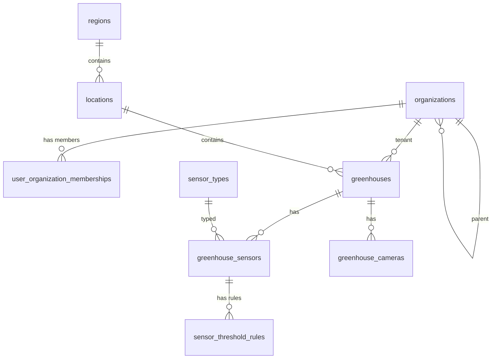

# Структура БД `CNT_GM_DB` (метаданные)

## Назначение и границы

`CNT_GM_DB` хранит **справочники и метаданные** системы greenhouse-monitoring (PostgreSQL), в соответствии с [ADR-0003](../../../adr/0003-use-postgres.md):

- **организации** и **связь пользователь ↔ организация** (доступ к теплицам через членство);
- теплицы и их иерархия расположения;
- типы и экземпляры датчиков;
- камеры и привязка к теплицам;
- конфигурация порогов событий;
- служебные связи для API.

Что **не хранится** в этой БД:

- телеметрия временных рядов датчиков (она в `CNT_GM_Timeseries_DB` / ClickHouse);
- учётные записи, пароли и токены OIDC (они в `CNT_GM_Identity_DB`); в метаданных хранится только **`user_id`**, совпадающий с **`sub`** / PK пользователя в Identity (логическая ссылка без FK между базами).

---

## Соглашения и типы

- СУБД: PostgreSQL.
- Именование: `snake_case`, таблицы во множественном числе (см. [psql-naming-conventions](../../../../standards/psql-naming-conventions.md)).
- Рекомендуемая схема: `app`.
- PK: `uuid`.
- Время: `timestamptz`.

---

## Логическая ER-модель

---

## 1) Организации и членство пользователей

### `organizations`

Справочник организаций (юридические/операционные единицы). Иерархия опциональна (`parent_id`).

| Поле | Тип | Описание |
|------|-----|----------|
| `id` | `uuid` | PK организации. |
| `code` | `varchar(64)` | Уникальный короткий код (интеграции, UI). |
| `name` | `varchar(512)` | Наименование. |
| `parent_id` | `uuid` | FK → `organizations.id`; `NULL` — корень. |
| `description` | `text` | Описание. |
| `is_active` | `boolean` | Активность записи. |
| `created_at` | `timestamptz` | Создание. |
| `updated_at` | `timestamptz` | Обновление. |

Индексы: `idx_organizations_code` (unique), `idx_organizations_parent_id`.

### `user_organization_memberships`

Связь учётной записи Identity с организацией. **`user_id`** — тот же идентификатор, что **`sub`** в access token (и PK в `asp_net_users`), тип **`uuid`** при `IdentityUser<Guid>`.

| Поле | Тип | Описание |
|------|-----|----------|
| `id` | `uuid` | Суррогатный PK. |
| `user_id` | `uuid` | Идентификатор пользователя в Identity (**без FK** между БД). |
| `organization_id` | `uuid` | FK → `organizations.id`. |
| `is_primary` | `boolean` | Основная организация в UI (не более одной активной на пользователя — контроль в приложении или частичный уникальный индекс). |
| `title` | `varchar(256)` | Должность в организации. |
| `membership_role` | `varchar(64)` | Роль в организации (`org_admin`, `member`, …). |
| `status` | `varchar(32)` | `active`, `invited`, `suspended`, … |
| `joined_at` | `timestamptz` | Начало членства. |
| `left_at` | `timestamptz` | Окончание; `NULL` — действующее. |
| `created_at` | `timestamptz` | Создание записи. |
| `updated_at` | `timestamptz` | Обновление записи. |

Ограничения: частичный уникальный индекс на `(user_id, organization_id)` при `left_at IS NULL`.  
Индексы: `idx_user_organization_memberships_user_id`, `idx_user_organization_memberships_organization_id`.

---

## 2) Локации и теплицы

### `regions`

| Поле | Тип | Описание |
|------|-----|----------|
| `id` | `uuid` | PK региона. |
| `code` | `varchar(32)` | Уникальный код региона. |
| `name` | `varchar(256)` | Наименование региона. |
| `is_active` | `boolean` | Активность записи. |
| `created_at` | `timestamptz` | Дата создания. |
| `updated_at` | `timestamptz` | Дата обновления. |

Индексы: `idx_regions_code` (unique), `idx_regions_name`.

### `locations`

| Поле | Тип | Описание |
|------|-----|----------|
| `id` | `uuid` | PK локации. |
| `region_id` | `uuid` | FK -> `regions.id`. |
| `code` | `varchar(32)` | Уникальный код внутри региона. |
| `name` | `varchar(256)` | Наименование площадки/локации. |
| `address` | `varchar(512)` | Адрес. |
| `latitude` | `numeric(9,6)` | Геопозиция (широта). |
| `longitude` | `numeric(9,6)` | Геопозиция (долгота). |
| `is_active` | `boolean` | Активность. |
| `created_at` | `timestamptz` | Дата создания. |
| `updated_at` | `timestamptz` | Дата обновления. |

Индексы: `idx_locations_region_id`, `idx_locations_code_region` (unique on `region_id, code`).

### `greenhouses`

| Поле | Тип | Описание |
|------|-----|----------|
| `id` | `uuid` | PK теплицы. |
| `organization_id` | `uuid` | FK -> `organizations.id`. Владелец/арендатор теплицы; фильтр «свои теплицы» через `user_organization_memberships`. |
| `location_id` | `uuid` | FK -> `locations.id`. |
| `code` | `varchar(32)` | Уникальный код теплицы. |
| `name` | `varchar(256)` | Отображаемое имя. |
| `area_m2` | `numeric(10,2)` | Площадь (м2), опционально. |
| `timezone` | `varchar(64)` | Таймзона (например `Europe/Moscow`). |
| `is_active` | `boolean` | Активность теплицы. |
| `commissioned_at` | `date` | Дата ввода в эксплуатацию. |
| `created_at` | `timestamptz` | Дата создания. |
| `updated_at` | `timestamptz` | Дата обновления. |

Индексы: `idx_greenhouses_organization_id`, `idx_greenhouses_location_id`, уникальность кода теплицы в рамках организации: `idx_greenhouses_org_code` (unique on `organization_id`, `code`).

---

## 3) Датчики и типы датчиков

### `sensor_types`

| Поле | Тип | Описание |
|------|-----|----------|
| `id` | `uuid` | PK типа датчика. |
| `code` | `varchar(64)` | Уникальный код типа (`temperature`, `humidity`, `soil_ph`). |
| `name` | `varchar(256)` | Наименование типа. |
| `default_unit` | `varchar(16)` | Базовая единица измерения (`C`, `%`, `pH`). |
| `value_min` | `numeric(12,4)` | Физически допустимый минимум. |
| `value_max` | `numeric(12,4)` | Физически допустимый максимум. |
| `is_active` | `boolean` | Активность. |
| `created_at` | `timestamptz` | Дата создания. |
| `updated_at` | `timestamptz` | Дата обновления. |

Индексы: `idx_sensor_types_code` (unique).

### `greenhouse_sensors`

Экземпляры установленных датчиков в конкретных теплицах.

| Поле | Тип | Описание |
|------|-----|----------|
| `id` | `uuid` | PK экземпляра датчика. |
| `greenhouse_id` | `uuid` | FK -> `greenhouses.id`. |
| `sensor_type_id` | `uuid` | FK -> `sensor_types.id`. |
| `external_sensor_key` | `varchar(128)` | Идентификатор датчика в контроллере/edge. |
| `display_name` | `varchar(256)` | Имя датчика для UI. |
| `install_position` | `varchar(128)` | Место установки (опционально). |
| `is_active` | `boolean` | Активность датчика. |
| `installed_at` | `date` | Дата установки. |
| `decommissioned_at` | `date` | Дата вывода из эксплуатации. |
| `created_at` | `timestamptz` | Дата создания. |
| `updated_at` | `timestamptz` | Дата обновления. |

Индексы: `idx_greenhouse_sensors_greenhouse_id`, `idx_greenhouse_sensors_sensor_type_id`, `idx_greenhouse_sensors_external_sensor_key` (unique).

---

## 4) Камеры

### `greenhouse_cameras`

| Поле | Тип | Описание |
|------|-----|----------|
| `id` | `uuid` | PK камеры. |
| `greenhouse_id` | `uuid` | FK -> `greenhouses.id`. |
| `camera_code` | `varchar(64)` | Уникальный код камеры. |
| `name` | `varchar(256)` | Наименование камеры. |
| `stream_profile` | `varchar(64)` | Профиль потока (`main`, `sub`, и т.п.). |
| `is_active` | `boolean` | Активность камеры. |
| `created_at` | `timestamptz` | Дата создания. |
| `updated_at` | `timestamptz` | Дата обновления. |

Индексы: `idx_greenhouse_cameras_greenhouse_id`, `idx_greenhouse_cameras_camera_code` (unique).

---

## 5) Правила порогов для событий

### `sensor_threshold_rules`

Правила для генерации событий в аналитике/поиске (FR-02).

| Поле | Тип | Описание |
|------|-----|----------|
| `id` | `uuid` | PK правила. |
| `greenhouse_sensor_id` | `uuid` | FK -> `greenhouse_sensors.id`. |
| `rule_code` | `varchar(64)` | Код правила (`high_temp`, `low_humidity`). |
| `operator` | `varchar(8)` | Оператор (`>`, `>=`, `<`, `<=`, `between`). |
| `threshold_min` | `numeric(12,4)` | Нижний порог (если применимо). |
| `threshold_max` | `numeric(12,4)` | Верхний порог (если применимо). |
| `severity` | `varchar(16)` | Критичность (`info`, `warning`, `critical`). |
| `is_enabled` | `boolean` | Включено ли правило. |
| `effective_from` | `timestamptz` | Начало действия. |
| `effective_to` | `timestamptz` | Окончание действия. |
| `created_at` | `timestamptz` | Дата создания. |
| `updated_at` | `timestamptz` | Дата обновления. |

Индексы: `idx_sensor_threshold_rules_sensor_id`, `idx_sensor_threshold_rules_enabled`.

---

## Связи с другими БД

### Связь с `CNT_GM_Timeseries_DB` (ClickHouse)

- Временные ряды хранят только `sensor_id`, `greenhouse_id`, `metric_code`.
- Эти идентификаторы ссылаются на `greenhouse_sensors.id` и `greenhouses.id` в `CNT_GM_DB`.
- Обогащение (названия, типы, расположение) выполняет `CNT_GM_WebAPI`.

### Связь с `CNT_GM_Identity_DB`

- Прямые FK между базами **не используются**.
- `user_organization_memberships.user_id` сопоставляется с идентификатором пользователя в Identity (`sub` / PK `asp_net_users`).
- Контроль доступа: `CNT_GM_WebAPI` по JWT определяет `user_id`, проверяет членство в `organization_id` и отдаёт только теплицы с совпадающим `greenhouses.organization_id`.

---

## Минимальные ограничения целостности

- `organizations.parent_id` -> `organizations.id` (`ON DELETE RESTRICT`)
- `user_organization_memberships.organization_id` -> `organizations.id` (`ON DELETE RESTRICT`)
- `greenhouses.organization_id` -> `organizations.id` (`ON DELETE RESTRICT`)
- `greenhouses.location_id` -> `locations.id` (`ON DELETE RESTRICT`)
- `locations.region_id` -> `regions.id` (`ON DELETE RESTRICT`)
- `greenhouse_sensors.greenhouse_id` -> `greenhouses.id` (`ON DELETE RESTRICT`)
- `greenhouse_sensors.sensor_type_id` -> `sensor_types.id` (`ON DELETE RESTRICT`)
- `greenhouse_cameras.greenhouse_id` -> `greenhouses.id` (`ON DELETE CASCADE` допустим для cleanup)
- `sensor_threshold_rules.greenhouse_sensor_id` -> `greenhouse_sensors.id` (`ON DELETE CASCADE`)

---

## Связанные документы

- Контейнер БД: [cnt_gm_db/model.c4](../../containers/cnt_gm_db/model.c4)
- ADR по PostgreSQL: [ADR-0003](../../../adr/0003-use-postgres.md)
- Структура БД Identity (без организаций): [identity_database_structure.md](../cnt_gm_identity_db/identity_database_structure.md)
- Структура БД телеметрии: [timeseries_database_structure.md](../cnt_gm_timeseries_db/timeseries_database_structure.md)
