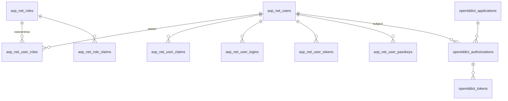

# Структура БД `CNT_GM_Identity_DB` (сервис Identity)

## Назначение и границы

База данных **CNT_GM_Identity_DB** хранит данные подсистемы **Identity** ([модель контейнера](../../containers/cnt_gm_identity_db/model.c4)): учётные записи, аутентификацию и авторизацию (в т.ч. OAuth/OIDC через **OpenIddict**) и **глобальные роли** пользователей. **Организации** и **членство пользователя в организации** описаны в БД метаданных **`CNT_GM_DB`** ([metadata_database_structure.md](../cnt_gm_db/metadata_database_structure.md)); прикладные справочники домена (теплицы, регионы, датчики и т.д.) также в **`CNT_GM_DB`** ([ADR-0003](../../../adr/0003-use-postgres.md)).

**СУБД:** PostgreSQL (как в архитектуре развёртывания и ADR).

**Стек приложения:** ASP.NET Core, **ASP.NET Core Identity** + **OpenIddict** + **EF Core 10** (Npgsql).

---

## Согласование имён таблиц с миграциями EF Core

Имена таблиц и колонок в этом документе заданы под **типовую** конфигурацию:

| Условие | Назначение |
|--------|------------|
| Провайдер | `Npgsql.EntityFrameworkCore.PostgreSQL` |
| Соглашение об именах | `EFCore.NamingConventions` → `UseSnakeCaseNamingConvention()` — имена CLR и стандартные имена таблиц Identity/OpenIddict преобразуются в **snake_case** в PostgreSQL ([psql-naming-conventions.md](../../../../standards/psql-naming-conventions.md)). |
| Identity | `IdentityDbContext<TUser, TRole, TKey>` / `AddIdentity` без переименования таблиц через `ToTable` — используются стандартные имена **AspNet***, которые после snake_case дают **`asp_net_*`**. |
| OpenIddict | `UseOpenIddict()` без кастомного `ToTable` — стандартные имена **OpenIddict***, после snake_case — **`openiddict_*`**. |
| Схема | Рекомендуется `modelBuilder.HasDefaultSchema("identity")` (или `ToTable(..., "identity")` для каждой сущности), чтобы все объекты лежали в схеме `identity`. |

Если в коде явно задать `ToTable("users")` или иное имя, миграции **разойдутся** с таблицей ниже — тогда обновите документ или верните имена к соглашению.

### Сводная таблица: сущность EF Core → имя таблицы в PostgreSQL

| Сущность / набор (типовой Identity + OpenIddict) | Таблица в БД (после snake_case) |
|--------------------------------------------------|----------------------------------|
| `IdentityUser` / `AspNetUsers` | `asp_net_users` |
| `IdentityRole` / `AspNetRoles` | `asp_net_roles` |
| `IdentityUserRole` / `AspNetUserRoles` | `asp_net_user_roles` |
| `IdentityUserClaim` / `AspNetUserClaims` | `asp_net_user_claims` |
| `IdentityRoleClaim` / `AspNetRoleClaims` | `asp_net_role_claims` |
| `IdentityUserLogin` / `AspNetUserLogins` | `asp_net_user_logins` |
| `IdentityUserToken` / `AspNetUserTokens` | `asp_net_user_tokens` |
| `IdentityUserPasskey` / `AspNetUserPasskeys` (схема Identity ≥ 3.0) | `asp_net_user_passkeys` |
| Сущность приложения OIDC/OAuth (по умолчанию таблица `OpenIddictApplications`) | `openiddict_applications` |
| Сущность области (`OpenIddictScopes`) | `openiddict_scopes` |
| Сущность авторизации (`OpenIddictAuthorizations`) | `openiddict_authorizations` |
| Сущность токена (`OpenIddictTokens`) | `openiddict_tokens` |

Точные имена типов сущностей OpenIddict зависят от версии пакета `OpenIddict.EntityFrameworkCore`; **имена таблиц по умолчанию** в конфигурации модели — `OpenIddictApplications`, `OpenIddictAuthorizations`, `OpenIddictScopes`, `OpenIddictTokens` ([документация OpenIddict + EF Core](https://documentation.openiddict.com/integrations/entity-framework-core)).

**Колонки:** стандартные свойства Identity/OpenIddict (`NormalizedEmail`, `UserId`, …) в миграциях становятся `normalized_email`, `user_id` и т.д. Дополнительные поля профиля (`CreatedAt`, `UpdatedAt`) в классе пользователя мапятся на `created_at`, `updated_at`.

---

## EF Core 10 и ASP.NET Core Identity (источник полей)

Описание полей ниже согласовано с:

- **EF Core 10** и пакетом **`Microsoft.AspNetCore.Identity.EntityFrameworkCore`** (ветка `main` репозитория [dotnet/aspnetcore](https://github.com/dotnet/aspnetcore): `IdentityUserContext`, `IdentityDbContext`, сущности в `Microsoft.AspNetCore.Identity`).
- **Версии схемы хранилища Identity** (`IdentitySchemaVersions`): для **Version 3** добавлена таблица **`AspNetUserPasskeys`**; при `SchemaVersion` **1.0** или **2.0** таблицы `asp_net_user_passkeys` в миграциях нет.

Перечисленные **ограничения длины** (`HasMaxLength`) и **ключи** — как в `OnModelCreating` Identity (Version 2/3); для полей без `HasMaxLength` в модели в PostgreSQL обычно получается неограниченный текст (`text`).

**Тип ключа `TKey`:** для пользователей и ролей в примерах ниже используется **`uuid`**, если в приложении зарегистрированы `IdentityUser<Guid>` и `IdentityRole<Guid>`. При использовании **`string`** (в т.ч. встроенный `IdentityUser` без generic — `IdentityUser<string>`) колонки `id`, `user_id`, `role_id` и т.п. в БД будут строковыми (`character varying` / `text`); скорректируйте типы в соответствии с миграцией.

**OpenIddict:** поля и длины строк — по конфигурациям `OpenIddictEntityFrameworkCore*Configuration` в [openiddict/openiddict-core](https://github.com/openiddict/openiddict-core) (типовой ключ `TKey` в шаблонах — **строка**; при замене на `Guid` типы PK/FK в PostgreSQL станут `uuid`).

**Унификация с доменной моделью (greenhouse-monitoring):** все **субъектные** идентификаторы, которые пересекаются с `CNT_GM_DB`, публичным REST/OpenAPI и ClickHouse (`greenhouse_id`, `sensor_id`, …), — **`uuid`**. В типовом шаблоне ASP.NET Core Identity поле **`id`** строк таблиц **`asp_net_user_claims`** и **`asp_net_role_claims`** — **`integer`**; в этом проекте зафиксировано **`uuid`** для этих PK, чтобы все первичные ключи строк в PostgreSQL (кроме служебных счётчиков вроде `access_failed_count`) были единообразны. Реализация: кастомные сущности claim с `Guid` PK и маппинг в EF Core вместо встроенных `IdentityUserClaim` / `IdentityRoleClaim` с `int Id`, либо эквивалентная миграция.

---

## Соглашения по именованию

Индексы и ограничения FK — по [psql-naming-conventions.md](../../../../standards/psql-naming-conventions.md): `idx_*`, `fk_*`. В описаниях ниже для краткости указаны логические имена; в миграциях их привяжите к фактическим таблицам `asp_net_*`, `openiddict_*`.

Рекомендуемая **схема PostgreSQL:** `identity`.

Типы времени: `timestamptz` для `DateTimeOffset`; для OpenIddict — `timestamp with time zone` для `DateTime?` в UTC.

---

## Обзор связей (логическая модель)

---

## 1. `asp_net_users` (`IdentityUser` / `AspNetUsers`)

| Колонка (snake_case) | Тип PostgreSQL (ориентир) | Ограничение в EF | Описание |
|----------------------|---------------------------|------------------|----------|
| `id` | `uuid` или `text` | PK | Первичный ключ пользователя (`TKey`). |
| `user_name` | `character varying(256)` | MaxLength(256) | Имя входа. |
| `normalized_user_name` | `character varying(256)` | MaxLength(256) | Нормализованное имя; уникальный индекс `UserNameIndex`. |
| `email` | `character varying(256)` | MaxLength(256) | Email. |
| `normalized_email` | `character varying(256)` | MaxLength(256) | Нормализованный email; индекс `EmailIndex`. |
| `email_confirmed` | `boolean` | — | Подтверждён ли email. |
| `password_hash` | `text` | — | Хэш пароля. |
| `security_stamp` | `text` | — | Сброс при смене учётных данных. |
| `concurrency_stamp` | `text` | ConcurrencyToken | Оптимистичная блокировка. |
| `phone_number` | `character varying(256)` | MaxLength(256), с schema ≥ 2.0 | Телефон. |
| `phone_number_confirmed` | `boolean` | — | Подтверждён ли телефон. |
| `two_factor_enabled` | `boolean` | — | Включена ли 2FA. |
| `lockout_end` | `timestamptz` | — | UTC-окончание блокировки (`DateTimeOffset?`). |
| `lockout_enabled` | `boolean` | — | Допустима ли блокировка. |
| `access_failed_count` | `integer` | — | Число неудачных попыток входа. |
| `created_at` | `timestamptz` | Прикладное поле | Не в базовом `IdentityUser`; добавляется в `ApplicationUser`. |
| `updated_at` | `timestamptz` | Прикладное поле | То же. |

**Связи:** `asp_net_user_roles`, `asp_net_user_claims`, `asp_net_user_logins`, `asp_net_user_tokens`, `asp_net_user_passkeys` (schema v3); при связи с OpenIddict — по `subject` в `openiddict_authorizations` / `openiddict_tokens` (строка, не всегда FK). Связь пользователя с организациями в **`CNT_GM_DB`**: колонка `user_organization_memberships.user_id` совпадает с `asp_net_users.id` / claim `sub` (без FK между базами).

---

## 2. Глобальные роли и связи Identity

### 2.1. `asp_net_roles` (`IdentityRole` / `AspNetRoles`)

| Колонка | Тип | Ограничение в EF | Описание |
|---------|-----|------------------|----------|
| `id` | `uuid` или `text` | PK | Первичный ключ роли (`TKey`). |
| `name` | `character varying(256)` | MaxLength(256) | Имя роли. |
| `normalized_name` | `character varying(256)` | MaxLength(256) | Нормализованное имя; уникальный индекс `RoleNameIndex`. |
| `concurrency_stamp` | `text` | ConcurrencyToken | Оптимистичная блокировка. |

### 2.2. `asp_net_user_roles` (`IdentityUserRole` / `AspNetUserRoles`)

| Колонка | Тип | Описание |
|---------|-----|----------|
| `user_id` | `uuid` или `text` | FK → `asp_net_users(id)`, CASCADE. Часть составного PK. |
| `role_id` | `uuid` или `text` | FK → `asp_net_roles(id)`, CASCADE. Часть составного PK. |

PK: `(user_id, role_id)`.

### 2.3. `asp_net_user_claims` (`IdentityUserClaim` / `AspNetUserClaims`)

| Колонка | Тип | Ограничение в EF | Описание |
|---------|-----|------------------|----------|
| `id` | `uuid` | PK | Суррогатный ключ строки claim (в проекте — `uuid`; не путать с `user_id`). |
| `user_id` | `uuid` или `text` | FK, обязательный | Владелец claim. |
| `claim_type` | `text` | — | URI типа claim. |
| `claim_value` | `text` | — | Значение claim. |

### 2.4. `asp_net_role_claims` (`IdentityRoleClaim` / `AspNetRoleClaims`)

| Колонка | Тип | Ограничение в EF | Описание |
|---------|-----|------------------|----------|
| `id` | `uuid` | PK | Суррогатный ключ строки claim (в проекте — `uuid`; не путать с `role_id`). |
| `role_id` | `uuid` или `text` | FK, обязательный | Роль, к которой относится claim. |
| `claim_type` | `text` | — | URI типа claim. |
| `claim_value` | `text` | — | Значение claim. |

### 2.5. `asp_net_user_logins` (`IdentityUserLogin` / `AspNetUserLogins`)

| Колонка | Тип | Ограничение в EF | Описание |
|---------|-----|------------------|----------|
| `login_provider` | `character varying(128)`* | MaxLength(128) по умолчанию* | Провайдер (Google, Microsoft и т.д.). |
| `provider_key` | `character varying(128)`* | MaxLength(128)* | Ключ внешнего аккаунта. |
| `provider_display_name` | `text` | — | Отображаемое имя провайдера. |
| `user_id` | `uuid` или `text` | FK, обязательный | Пользователь. |

\* Если `StoreOptions.MaxLengthForKeys` не задан, в коде Identity подставляется **128** (Version 2/3).

PK: `(login_provider, provider_key)`.

### 2.6. `asp_net_user_tokens` (`IdentityUserToken` / `AspNetUserTokens`)

| Колонка | Тип | Ограничение в EF | Описание |
|---------|-----|------------------|----------|
| `user_id` | `uuid` или `text` | FK, обязательный | Пользователь. |
| `login_provider` | `character varying(128)`* | MaxLength(128)* | Провайдер токена. |
| `name` | `character varying(128)`* | MaxLength(128)* | Имя токена (например, `AccessToken`, `RefreshToken`). |
| `value` | `text` | — | Значение (может быть защищено `ProtectPersonalData`). |

PK: `(user_id, login_provider, name)`.

### 2.7. `asp_net_user_passkeys` (`IdentityUserPasskey` / `AspNetUserPasskeys`, schema Version 3)

Появляется при **Identity schema version 3.0** и использовании API passkeys / WebAuthn.

| Колонка | Тип | Ограничение в EF | Описание |
|---------|-----|------------------|----------|
| `user_id` | `uuid` или `text` | FK, обязательный | Владелец passkey. |
| `credential_id` | `bytea` | PK, MaxLength(1024) в конфигурации | Идентификатор credential (WebAuthn). |
| `data` | `json` / `jsonb` | `ComplexProperty(...).ToJson()` | Вложенный объект `IdentityPasskeyData`: `PublicKey`, `Name`, `CreatedAt`, `SignCount`, `Transports`, флаги резервного копирования, `AttestationObject`, `ClientDataJson`, `Aaguid` и др. |

PK: `credential_id`. Индексы по FK на пользователя создаются через навигацию в модели.

---

## 3. OpenIddict

Имена колонок — после `UseSnakeCaseNamingConvention()`. Внешние ключи на приложение и авторизацию в OpenIddict задаются как **теневые** (concatenation `Application` + `Id` → колонка `application_id` и т.д. в snake_case); **тип** совпадает с `TKey` OpenIddict (часто **строка**).

### 3.1. `openiddict_applications`

| Колонка | Тип | Ограничение в EF (OpenIddict) | Описание |
|---------|-----|-------------------------------|----------|
| `id` | `text` / `uuid` | PK | Идентификатор приложения. |
| `application_type` | `character varying(50)` | MaxLength(50) | Тип приложения (web, native и т.п. в терминах OpenIddict). |
| `client_id` | `character varying(100)` | MaxLength(100), уникальный индекс | Client ID. |
| `client_secret` | `text` | — | Секрет (может быть хэширован). |
| `client_type` | `character varying(50)` | MaxLength(50) | public / confidential и т.д. |
| `concurrency_token` | `character varying(50)` | MaxLength(50), concurrency | Версионирование строки. |
| `consent_type` | `character varying(50)` | MaxLength(50) | Тип согласия (explicit, implicit, …). |
| `display_name` | `text` | — | Отображаемое имя клиента. |
| `display_names` | `text` | JSON | Локализованные имена (JSON). |
| `json_web_key_set` | `text` | JSON | JWKS клиента. |
| `permissions` | `text` | JSON | Разрешения (JSON-массив). |
| `post_logout_redirect_uris` | `text` | JSON | Post-logout redirect URI (JSON-массив). |
| `properties` | `text` | JSON | Дополнительные свойства. |
| `redirect_uris` | `text` | JSON | Redirect URI (JSON-массив). |
| `requirements` | `text` | JSON | Требования (например, PKCE), JSON-массив. |
| `settings` | `text` | JSON | Настройки клиента (JSON). |

### 3.2. `openiddict_scopes`

| Колонка | Тип | Ограничение в EF | Описание |
|---------|-----|------------------|----------|
| `id` | `text` / `uuid` | PK | Идентификатор области. |
| `concurrency_token` | `character varying(50)` | MaxLength(50), concurrency | Версионирование. |
| `description` | `text` | — | Описание scope. |
| `descriptions` | `text` | JSON | Локализованные описания. |
| `display_name` | `text` | — | Отображаемое имя. |
| `display_names` | `text` | JSON | Локализованные имена. |
| `name` | `character varying(200)` | MaxLength(200), уникальный индекс | Уникальное имя scope (`openid`, `profile`, …). |
| `properties` | `text` | JSON | Дополнительные свойства. |
| `resources` | `text` | JSON | Ресурсы (JSON-массив). |

### 3.3. `openiddict_authorizations`

| Колонка | Тип | Ограничение в EF | Описание |
|---------|-----|------------------|----------|
| `id` | `text` / `uuid` | PK | Идентификатор авторизации. |
| `application_id` | `text` / `uuid` | FK → `openiddict_applications`, опционально | Клиент OAuth/OIDC. |
| `concurrency_token` | `character varying(50)` | MaxLength(50), concurrency | Версионирование. |
| `creation_date` | `timestamptz` | — | UTC-время создания. |
| `properties` | `text` | JSON | Дополнительные свойства. |
| `scopes` | `text` | JSON | Назначенные области (JSON-массив). |
| `status` | `character varying(50)` | MaxLength(50) | Статус авторизации. |
| `subject` | `character varying(400)` | MaxLength(400) | Субъект (обычно id пользователя в `asp_net_users`). |
| `type` | `character varying(50)` | MaxLength(50) | Тип авторизации. |

Составной индекс по `(application_id, status, subject, type)` (имена колонок в БД — snake_case).

### 3.4. `openiddict_tokens`

| Колонка | Тип | Ограничение в EF | Описание |
|---------|-----|------------------|----------|
| `id` | `text` / `uuid` | PK | Идентификатор токена. |
| `application_id` | `text` / `uuid` | FK → `openiddict_applications`, опционально | Клиент. |
| `authorization_id` | `text` / `uuid` | FK → `openiddict_authorizations`, опционально | Связанная авторизация. |
| `concurrency_token` | `character varying(50)` | MaxLength(50), concurrency | Версионирование. |
| `creation_date` | `timestamptz` | — | UTC-время создания. |
| `expiration_date` | `timestamptz` | — | UTC-время истечения. |
| `payload` | `text` | — | Полезная нагрузка (reference tokens и т.д.). |
| `properties` | `text` | JSON | Дополнительные свойства. |
| `redemption_date` | `timestamptz` | — | UTC-время погашения. |
| `reference_id` | `character varying(100)` | MaxLength(100), уникальный индекс | Внешний идентификатор reference token. |
| `status` | `character varying(50)` | MaxLength(50) | Статус токена. |
| `subject` | `character varying(400)` | MaxLength(400) | Субъект. |
| `type` | `character varying(150)` | MaxLength(150) | Тип токена (access, refresh, id, …). |

Составной индекс по `(application_id, status, subject, type)`.

---

## 4. Роли (глобальные)

| Механизм | Таблицы EF / PostgreSQL | Назначение |
|----------|-------------------------|------------|
| Глобальные роли | `AspNetRoles` / `AspNetUserRoles` → `asp_net_roles`, `asp_net_user_roles` | Системные роли (сотрудник, инженер и т.д.). |

Роли и права **внутри организации** (`membership_role`, списки организаций пользователя) — в **`CNT_GM_DB`**, см. [metadata_database_structure.md](../cnt_gm_db/metadata_database_structure.md).

---

## 5. Безопасность и эксплуатация

- Секреты клиентов OIDC и ключи подписи JWT при промышленной конфигурации частично размещаются в **Vault**; в БД не хранить открытые долгоживущие секреты без необходимости.
- Резервное копирование и репликация — в общем контуре PostgreSQL (см. [production-deployment.c4](../../infrastructure/production-deployment.c4)).
- Изменение схемы — через миграции EF Core; после первой миграции сверьте имена и типы с разделами выше.

---

## Связанные документы

- Контейнер БД: [model.c4](../../containers/cnt_gm_identity_db/model.c4)
- ADR по PostgreSQL: [ADR-0003](../../../adr/0003-use-postgres.md)
- БД метаданных (организации, теплицы): [metadata_database_structure.md](../cnt_gm_db/metadata_database_structure.md)
- Соглашения SQL: [psql-naming-conventions.md](../../../../standards/psql-naming-conventions.md)
- Контекст узлов: [project-context.md](../../../../ai/project-context.md)
