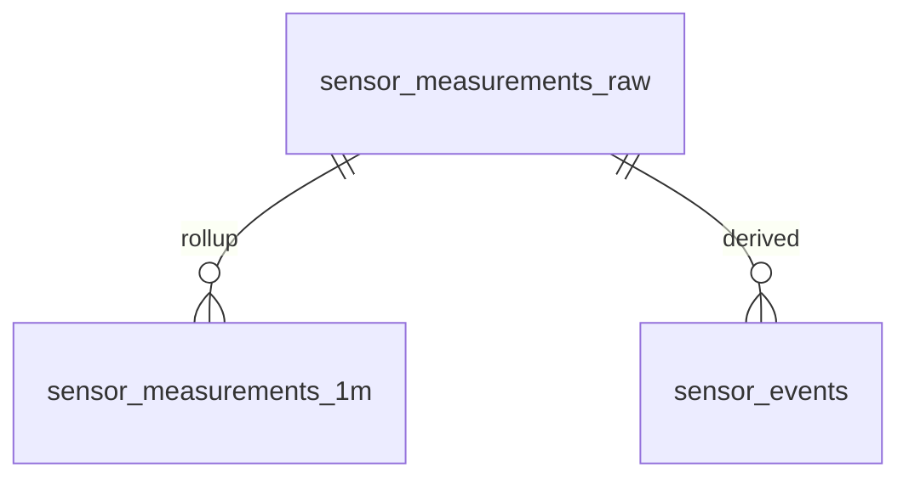

# Структура БД `CNT_GM_Timeseries_DB` (данные датчиков)

## Назначение и границы

`CNT_GM_Timeseries_DB` предназначена для хранения и аналитики временных рядов датчиков (температура, влажность, кислотность почвы) в соответствии с [ADR-0004](../../../adr/0004-clickhouse-telemetry.md).

- **СУБД:** ClickHouse.
- **Пишет:** `CNT_GM_SavingService` (ингест из RabbitMQ/AMQP после MQTT).
- **Читает:** `CNT_GM_WebAPI` (поиск событий, архивная аналитика).
- **Не хранит:** справочники теплиц/датчиков/организаций и пользователей (они остаются в `CNT_GM_DB`).

---

## Логическая модель



---

## 1) Таблица сырых измерений `sensor_measurements_raw`

Основная fact-таблица для потока телеметрии.

### DDL (предложение)

```sql
CREATE TABLE sensor_measurements_raw
(
    measured_at           DateTime64(3, 'UTC'),
    greenhouse_id         UUID,
    sensor_id             UUID,
    sensor_type_code      LowCardinality(String), -- temperature | humidity | soil_ph
    metric_code           LowCardinality(String), -- например: air_temperature_c
    value                 Float64,
    unit                  LowCardinality(String), -- C | % | pH
    quality_code          LowCardinality(String), -- ok | suspect | invalid
    ingest_id             UUID,                   -- id сообщения/батча для идемпотентности
    source_ts             DateTime64(3, 'UTC'),   -- время на контроллере
    received_at           DateTime64(3, 'UTC')    -- время получения системой
)
ENGINE = MergeTree
PARTITION BY toYYYYMM(measured_at)
ORDER BY (greenhouse_id, sensor_id, measured_at)
TTL measured_at + INTERVAL 24 MONTH
SETTINGS index_granularity = 8192;
```

### Поля

| Поле | Тип | Назначение |
|------|-----|------------|
| `measured_at` | `DateTime64(3, 'UTC')` | Время измерения (основная временная ось). |
| `greenhouse_id` | `UUID` | Ссылка на теплицу в `CNT_GM_DB`. |
| `sensor_id` | `UUID` | Ссылка на установленный датчик в `CNT_GM_DB`. |
| `sensor_type_code` | `LowCardinality(String)` | Тип датчика для быстрых фильтров и группировок. |
| `metric_code` | `LowCardinality(String)` | Код метрики (что измеряли). |
| `value` | `Float64` | Значение измерения. |
| `unit` | `LowCardinality(String)` | Единица измерения. |
| `quality_code` | `LowCardinality(String)` | Статус качества точки. |
| `ingest_id` | `UUID` | Идемпотентность/трассировка загрузки. |
| `source_ts` | `DateTime64(3, 'UTC')` | Время на источнике (контроллере). |
| `received_at` | `DateTime64(3, 'UTC')` | Время приёма в контуре ingestion. |

### Индексы данных (опционально)

```sql
ALTER TABLE sensor_measurements_raw
    ADD INDEX idx_metric_code metric_code TYPE set(1024) GRANULARITY 4;

ALTER TABLE sensor_measurements_raw
    ADD INDEX idx_sensor_type sensor_type_code TYPE set(64) GRANULARITY 4;
```

---

## 2) Агрегаты по минутам `sensor_measurements_1m`

Ускоряет FR-02 и инженерные выборки на больших интервалах.

### DDL (предложение)

```sql
CREATE TABLE sensor_measurements_1m
(
    bucket_1m             DateTime('UTC'),
    greenhouse_id         UUID,
    sensor_id             UUID,
    sensor_type_code      LowCardinality(String),
    metric_code           LowCardinality(String),
    unit                  LowCardinality(String),
    cnt                   UInt32,
    min_value             Float64,
    max_value             Float64,
    avg_value             Float64,
    p95_value             Float64
)
ENGINE = MergeTree
PARTITION BY toYYYYMM(bucket_1m)
ORDER BY (greenhouse_id, sensor_id, bucket_1m)
TTL bucket_1m + INTERVAL 24 MONTH;
```

### Поля

| Поле | Тип | Назначение |
|------|-----|------------|
| `bucket_1m` | `DateTime('UTC')` | Временной бакет 1 минута. |
| `greenhouse_id` | `UUID` | Ссылка на теплицу (`CNT_GM_DB`). |
| `sensor_id` | `UUID` | Ссылка на датчик (`CNT_GM_DB`). |
| `sensor_type_code` | `LowCardinality(String)` | Тип датчика. |
| `metric_code` | `LowCardinality(String)` | Код метрики. |
| `unit` | `LowCardinality(String)` | Единица измерения. |
| `cnt` | `UInt32` | Количество точек в бакете. |
| `min_value` | `Float64` | Минимум за минуту. |
| `max_value` | `Float64` | Максимум за минуту. |
| `avg_value` | `Float64` | Среднее за минуту. |
| `p95_value` | `Float64` | 95-й перцентиль. |

### Заполнение

- Либо батчами в `CNT_GM_SavingService`,
- либо materialized view от `sensor_measurements_raw`.

---

## 3) Таблица событий `sensor_events`

Производная таблица для сценария поиска событий (FR-02).

### DDL (предложение)

```sql
CREATE TABLE sensor_events
(
    event_id              UUID,
    event_type_code       LowCardinality(String), -- threshold_exceeded | anomaly | offline
    detected_at           DateTime64(3, 'UTC'),
    greenhouse_id         UUID,
    sensor_id             UUID,
    metric_code           LowCardinality(String),
    severity              LowCardinality(String), -- info | warning | critical
    value                 Float64,
    threshold_value       Nullable(Float64),
    status                LowCardinality(String), -- open | closed
    correlation_id        Nullable(UUID),         -- связь с батчем/пайплайном
    payload_json          String
)
ENGINE = MergeTree
PARTITION BY toYYYYMM(detected_at)
ORDER BY (greenhouse_id, detected_at, event_id)
TTL detected_at + INTERVAL 24 MONTH;
```

### Поля

| Поле | Тип | Назначение |
|------|-----|------------|
| `event_id` | `UUID` | Идентификатор события. |
| `event_type_code` | `LowCardinality(String)` | Тип события. |
| `detected_at` | `DateTime64(3, 'UTC')` | Время фиксации события. |
| `greenhouse_id` | `UUID` | Ссылка на теплицу (`CNT_GM_DB`). |
| `sensor_id` | `UUID` | Ссылка на датчик (`CNT_GM_DB`). |
| `metric_code` | `LowCardinality(String)` | Метрика события. |
| `severity` | `LowCardinality(String)` | Критичность. |
| `value` | `Float64` | Фактическое значение. |
| `threshold_value` | `Nullable(Float64)` | Порог (если применимо). |
| `status` | `LowCardinality(String)` | Статус обработки/жизненного цикла. |
| `correlation_id` | `Nullable(UUID)` | Трассировка через пайплайн. |
| `payload_json` | `String` | Дополнительные параметры события (JSON). |

---

## Связи с БД метаданных (`CNT_GM_DB`)

Связь выполняется через **стабильные идентификаторы** (`greenhouse_id`, `sensor_id`, при необходимости `organization_id`) и API-слой:

1. `CNT_GM_DB` хранит справочники:
   - теплицы,
   - установленные датчики,
   - типы датчиков,
   - организационную структуру.
2. `CNT_GM_Timeseries_DB` хранит только факт телеметрии и событий.
3. `CNT_GM_WebAPI` при запросах:
   - фильтрует/читает временные ряды в ClickHouse,
   - обогащает результаты метаданными из PostgreSQL,
   - возвращает агрегированный DTO в GraphQL.

### Почему так

- нет дублирования «истины» по справочникам;
- проще менять метаданные без миграций больших time-series таблиц;
- сохраняется производительность ClickHouse на вставке/аналитике.

### Практика согласованности

- в ingest-сервисе валидировать `sensor_id`/`greenhouse_id` по кэшу справочников;
- soft-fail для «осиротевших» ключей (помечать `quality_code = invalid_ref`);
- периодическая проверка консистентности фоновым job.

---

## Рекомендуемые запросы (пример)

```sql
-- Последние 15 минут по теплице и метрике
SELECT measured_at, sensor_id, value, unit
FROM sensor_measurements_raw
WHERE greenhouse_id = toUUID('00000000-0000-0000-0000-000000000001')
  AND metric_code = 'air_temperature_c'
  AND measured_at >= now() - INTERVAL 15 MINUTE
ORDER BY measured_at;
```

```sql
-- Поиск критических событий за период
SELECT event_id, detected_at, greenhouse_id, sensor_id, metric_code, value
FROM sensor_events
WHERE severity = 'critical'
  AND detected_at BETWEEN toDateTime('2026-01-01 00:00:00') AND toDateTime('2026-01-31 23:59:59')
ORDER BY detected_at DESC
LIMIT 500;
```

---

## Связанные документы

- Контейнер БД: [cnt_gm_timeseries_db/model.c4](../../containers/cnt_gm_timeseries_db/model.c4)
- ADR по выбору ClickHouse: [ADR-0004](../../../adr/0004-clickhouse-telemetry.md)
- Технологический стек: [tech-stack.md](../../../../ai/tech-stack.md)
- Расчёт нагрузки и объёмов: [calc_architecture.md](../../../calc_architecture.md)
