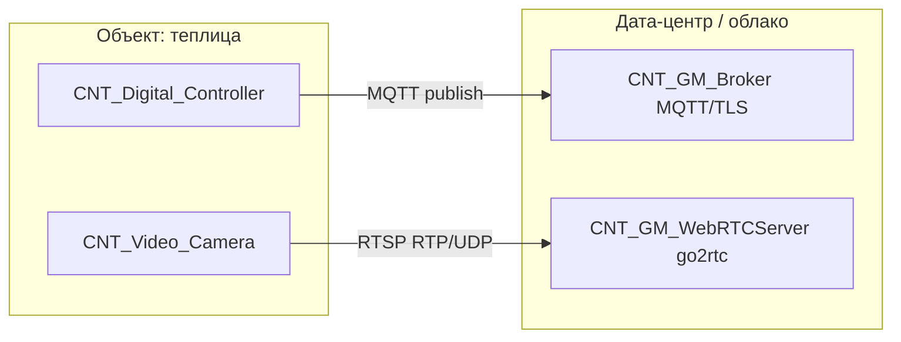

# Интерфейс интеграции: камеры и MQTT-контроллеры на объекте «теплица»

## Назначение и границы документа

Документ фиксирует **внешний интерфейс** между оборудованием на теплице и платформой greenhouse-monitoring:

- **CNT_Digital_Controller** — контроллер датчиков (температура, влажность, кислотность почвы), публикация телеметрии по **MQTT** в **CNT_GM_Broker** (RabbitMQ с MQTT-плагином).
- **CNT_Video_Camera** — IP-камера, источник **RTSP** для медиа-слоя (**go2rtc**, контейнеры `CNT_GM_WebRTCServer_*`).

Внутреннюю маршрутизацию MQTT → AMQP, запись в ClickHouse, API и веб-клиент здесь **не** детализируем; на них есть ссылки в разделе «Связанные артефакты».

Трассируемость к требованиям: [BR-R02](../../requirements/business/03-business-rules.md#br-r02-состав-оборудования-в-теплице), [BR-R03](../../requirements/business/03-business-rules.md#br-r03-передача-данных-с-контроллера-по-mqtt), [BR-R04](../../requirements/business/03-business-rules.md#br-r04-передача-видеопотока-по-rtsp), [BR-R05](../../requirements/business/03-business-rules.md#br-r05-задержка-в-режиме-реального-времени); [FR-01](../../requirements/functional/01-live-video-monitoring.md).

---

## 1. Общая схема взаимодействия



Классы трафика разделены: **MQTT** (телеметрия) и **RTSP/медиа** (видео) — отдельные каналы и типично отдельные сетевые политики ([пример деплоя](../architecture/diagram/infrastructure/deployment-diagram-prompt-example.md)).

---

## 2. Интерфейс MQTT (цифровой контроллер)

### 2.1. Транспорт и доступ

| Параметр | Значение / ожидание |
|----------|---------------------|
| Протокол | MQTT **v3.1.1** или **v5.0** (уточнить в ТКП; брокер — RabbitMQ MQTT plugin) |
| Транспорт | **TLS** поверх TCP (типичный периметр **8883**; фактический порт и hostname — из эксплуатационной конфигурации) |
| Направление | Контроллер **только публикует** (publish); подписки на стороне контроллера не требуются для базового сценария телеметрии |
| Сессия | Постоянное соединение на объект; оценка масштаба **~1000** одновременных MQTT-сессий по всем теплицам ([calc_architecture.md](../architecture/calc_architecture.md)) |

**Аутентификация** (на выбор проекта поставщика оборудования, единообразие фиксируется в ТКП):

- пары **username/password** по TLS; или
- клиентские **сертификаты** (mTLS).

Учётные данные и корневаой CA для проверки сервера брокера выдаются при **онбординге** теплицы/контроллера; хранение секретов на стороне платформы — см. [ADR-0007](../architecture/adr/0007-hashicorp-vault-secrets.md).

### 2.2. Идентификация объектов

Связь с метаданными PostgreSQL ([`greenhouses`](../../architecture/diagram/data/cnt_gm_db/metadata_database_structure.md#greenhouses), [`greenhouse_sensors`](../../architecture/diagram/data/cnt_gm_db/metadata_database_structure.md#greenhouse_sensors)):

- У теплицы в ИС есть стабильный **`code`** (код теплицы в организации).
- У каждого экземпляра датчика — **`external_sensor_key`**, согласованный с прошивкой контроллера (уникален в рамках теплицы).

Контроллер должен позволять **настройку** `greenhouse_code` (или эквивалентного внешнего идентификатора, однозначно сопоставимого с `greenhouses.code`) и ключей датчиков так, чтобы они совпали с записями в БД.

### 2.3. Соглашение по топикам (черновик контракта)

Ниже — **рекомендуемая** схема для согласования с вендором; финальная карта топиков → exchange/queue RabbitMQ фиксируется в интеграционной спецификации брокера ([ADR-0005](../architecture/adr/0005-rabbitmq-mqtt-broker.md)).

Префикс:

```text
gm/{organization_code}/{greenhouse_code}/telemetry/{sensor_reading|lifecycle}
```

Примеры:

- `gm/acme/gh-042/telemetry/sensor_reading` — показания датчиков.
- `gm/acme/gh-042/telemetry/lifecycle` — опционально: старт, диагностика, ошибка (если нужны для мониторинга поля).

**QoS:** рекомендуется **QoS 1** для показаний (хотя бы однократная доставка), **retain = false** для потока измерений (если не оговорено иначе для recovery).

**Client ID:** уникален в кластере брокера; типичный шаблон `ctrl-{greenhouse_code}` или заводской серийный номер при гарантии уникальности.

### 2.4. Формат полезной нагрузки (JSON)

Сообщения в кодировке **UTF-8**, тип содержимого по соглашению **`application/json`**.

**Чтение датчиков** (публикация при **инициализации** контроллера и при **изменении** значения — [BR-R03](../../requirements/business/03-business-rules.md#br-r03-передача-данных-с-контроллера-по-mqtt)):

```json
{
  "schema_version": "1.0",
  "message_type": "sensor_reading",
  "greenhouse_code": "gh-042",
  "greenhouse_id": "550e8400-e29b-41d4-a716-446655440001",
  "device_time": "2026-04-11T12:34:56.789+03:00",
  "readings": [
    {
      "external_sensor_key": "temp-main",
      "quantity": "temperature",
      "value": 22.5,
      "unit": "C"
    },
    {
      "external_sensor_key": "hum-main",
      "quantity": "humidity",
      "value": 61.0,
      "unit": "%"
    },
    {
      "external_sensor_key": "ph-bed-1",
      "quantity": "soil_ph",
      "value": 6.2,
      "unit": "pH"
    }
  ]
}
```

Правила:

- **`greenhouse_id`** (опционально) — UUID теплицы в ИС (`greenhouses.id`); дублирует привязку рядом с **`greenhouse_code`** для трассировки и согласования с API/ClickHouse. Если передан, должен соответствовать записи с тем же `code`.
- **`quantity`** должен однозначно сопоставляться с типами датчиков в ИС (`temperature`, `humidity`, `soil_ph` — см. [`sensor_types.code`](../../architecture/diagram/data/cnt_gm_db/metadata_database_structure.md#sensor_types)).
- **`value`** — число; допустимый диапазон согласуется с физикой и справочником типов.
- **`device_time`** — время на контроллере (желательно с offset); при отсутствии доверенного времени на устройстве в ТКП описывается fallback (время приёма на брокере).

Опциональное расширение: одно сообщение на один датчик и упрощённое тело — допустимо, если сохраняется связка `external_sensor_key` + `quantity` + `value` + время.

### 2.5. Частота и задержка

- Логика отправки на стороне контроллера: **событийная** (старт + изменение), не обязательный фиксированный периодический опрос в ИС.
- Сквозная задержка от публикации до UI — **не более 30 с** ([NFR-01](../../requirements/non-functional/01-latency-live-stream.md), BR-R05); при проектировании частоты «дребезга» и порогов изменения это ограничение учитывается.

### 2.6. Ошибки и устойчивость

- Повторное подключение с **exponential backoff** при обрыве TLS/MQTT.
- При длительной недоступности брокера — локальная буферизация **опциональна**; при её наличии описать предельный объём и порядок выгрузки (FIFO), чтобы не нарушать актуальность данных в UI.

---

## 3. Интерфейс камер (RTSP)

### 3.1. Транспорт и роль камеры

| Параметр | Значение / ожидание |
|----------|---------------------|
| Протокол | **RTSP 1.0** (как минимум); конкретный профиль (H.264/H.265, AAC и т.д.) — по модели камеры |
| Транспорт | Типично **554/TCP** для сигналинга; **RTP** (часто UDP **5004–5005** или диапазон, задаваемый камерой) для медиа — согласно модели связей [CNT_GM_WebRTCServer_Only](../architecture/diagram/containers/cnt_gm_webrtcserver_only/model.c4) |
| Направление | Камера — **сервер** RTSP; **go2rtc** — **клиент**, инициирующий подключение к камере (исходящий из медиа-сегмента к VLAN камер) |

Количество камер на теплицу — **до 5** ([BR-R02](../../requirements/business/03-business-rules.md#br-r02-состав-оборудования-в-теплице)).

### 3.2. Идентификация и метаданные

В PostgreSQL камера описана в [`greenhouse_cameras`](../../architecture/diagram/data/cnt_gm_db/metadata_database_structure.md#greenhouse_cameras):

- **`camera_code`** — уникальный код в рамках интеграции (сопоставление с конфигурацией go2rtc / внутренним именем потока).
- **`stream_profile`** — например `main` / `sub` для выбора URL основного или субпотока.

**URL RTSP** в эксплуатации хранится как секрет или конфигурация медиа-слоя (логин/пароль камеры не в открытом API); отображаемое имя и код — в метаданных для UI.

Пример шаблона URL (иллюстративно):

```text
rtsp://{user}:{password}@{camera_host}:{554}/Streaming/Channels/{channel}{@stream_profile}
```

Точный путь — из документации производителя камеры; для нескольких камер на объекте — различимые `{camera_host}` и/или каналы.

### 3.3. Требования к сети и безопасности

- Доступность RTSP из **сегмента, где размещён go2rtc**, с учётом firewall (часто выделенный VLAN камер).
- Рекомендуется **аутентификация RTSP** (Digest/Basic — по возможностям камеры); см. также риски в [threat-model](../architecture/diagram/security/threat-model.md).

### 3.4. Доставка в браузер

Интеграция **камеры** на границе контракта заканчивается на **стабильном RTSP-источнике**, доступном для go2rtc. Преобразование **RTSP → WebRTC/MSE** для клиента — ответственность платформы ([tech-stack.md](../../ai/tech-stack.md)); требования к задержке live — [NFR-01](../../requirements/non-functional/01-latency-live-stream.md).

---

## 4. Сводная таблица интерфейсов

| Источник | Протокол | Куда в контуре платформы | Ключевые идентификаторы |
|----------|-----------|---------------------------|-------------------------|
| Контроллер | MQTT over TLS | CNT_GM_Broker | `organization_code`, `greenhouse_code`, `external_sensor_key` |
| Камера | RTSP (+ RTP) | CNT_GM_WebRTCServer (go2rtc) | `greenhouse_id` / `camera_code`, URL в секретах |

---

## 5. Открытые пункты для ТКП / поставщика

1. Окончательная **карта топиков MQTT** и привязка к **exchange/queue** RabbitMQ (дополнение к [ADR-0005](../architecture/adr/0005-rabbitmq-mqtt-broker.md)).
2. Выбор **MQTT v3.1.1 vs v5** и поддерживаемые **возможности** плагина на принятой версии RabbitMQ.
3. Необходимость **LWT** (Last Will) и **retained** сообщений для статуса контроллера.
4. Список **моделей камер** и закреплённые **RTSP URL** / кодеки для тестовых стендов.
5. Требования к **синхронизации времени** (NTP) на контроллере для корректного `device_time`.

---

## Связанные артефакты

- [ADR-0005 — RabbitMQ и MQTT](../architecture/adr/0005-rabbitmq-mqtt-broker.md)
- [ADR-0004 — ClickHouse для телеметрии](../architecture/adr/0004-clickhouse-telemetry.md)
- [Модель CNT_Digital_Controller](../architecture/diagram/containers/cnt_greenhouse/cnt_digital_controller/model.c4)
- [Модель CNT_GM_WebRTCServer_Only](../architecture/diagram/containers/cnt_gm_webrtcserver_only/model.c4)
- [Структура метаданных PostgreSQL](../architecture/diagram/data/cnt_gm_db/metadata_database_structure.md)
