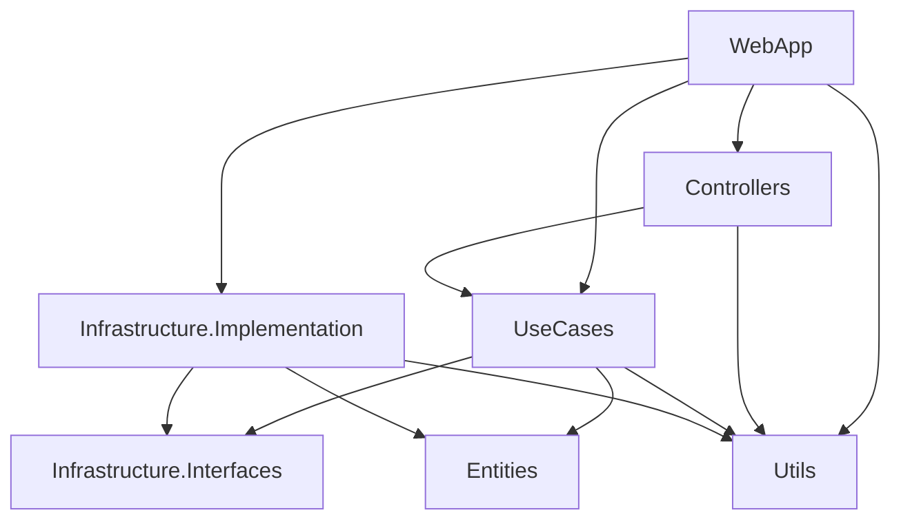

# Требования к архитектуре приложения backend

Целевая структура backend-сервисов в духе чистой архитектуры: слои, сборки и правила зависимостей. Шаблон имён сборок и нумерация согласованы с общим документом [10-app-architecture.md](../10-app-architecture.md). Текущая реализация в репозитории может отставать от этой спеки — структура ниже задаёт **целевой** эталон при развитии сервиса.

## Структура папок и сборок

В корне сервиса создаются папки с фиксированным префиксом номера. Имя каждой сборки следует шаблону из [10-app-architecture.md](../10-app-architecture.md): `GM.<НазваниеСервиса>.<Назначение>` (пример: `GM.SavingService.Entities`, `GM.WebApi.DataAccess.Postgres`).

| № | Папка | Сборка (пример назначения) | Краткое назначение |
|---|--------|----------------------------|-------------------|
| 0 | `0 Utils` | `GM.<Сервис>.Utils` | Общие методы, расширения, вспомогательные типы без привязки к сценариям |
| 1 | `1 Entities` | `GM.<Сервис>.Entities` | Доменные сущности, value objects |
| 2 | `2 Infrastructure.Interfaces` | `GM.<Сервис>.DataAccess.Interfaces`, `GM.<Сервис>.RabbitMQ.Interfaces` | Абстракции персистентности, messaging, внешних API |
| 3 | `3 UseCases` | `GM.<Сервис>.UseCases` | Сценарии приложения, CQRS (команды/запросы, обработчики) |
| 4 | `4 Controllers` | `GM.<Сервис>.Controllers` | HTTP-контроллеры при вынесении из WebApp (опционально) |
| 5 | `5 Infrastructure.Implementation` | `GM.<Сервис>.DataAccess.Postgres`, `GM.<Сервис>.RabbitMQ.Implementation` | Реализации абстракций §2 |
| 6 | `6 WebApp` | `GM.<Сервис>.WebApp` | Точка входа ASP.NET, DI, middleware, OpenAPI |
| 7 | `7 Tests` | `GM.<Сервис>.Tests` | Автотесты |

## Правила зависимостей (граф)

Стрелка означает «слой **использует** (ссылается на) нижележащий».

Если сборка `Controllers` не выделяется, на схеме нет узла `Controllers` и связи `WebApp` → `Controllers`: `WebApp` напрямую содержит minimal API или контроллеры и ссылается на `UseCases` и `Infrastructure.Implementation`.

---

### 0 Utils

**Назначение.** Сборка с переиспользуемыми расширениями, guard-утверждениями, маппингом без доменной логики сценария.

**Зависимости.** Предпочтительно только BCL; ссылка на `Entities` допускается только для узких расширений над типами сущностей (избегать разрастания).

**Примеры типов.** Статические `*Extensions`, `ArgumentGuard`, общие константы ошибок.

---

### 1 Entities

**Назначение.** Доменная модель: сущности, enums домена, value objects. **Rich model:** инварианты и поведение внутри типов, без интерфейсов репозиториев и без обращения к БД.

**Зависимости.** Не ссылается на другие проекты сервиса (кроме при необходимости `Utils` для чисто технических хелперов — по согласованию в команде).

**Примеры типов.** `Greenhouse`, `SensorReading` (агрегаты/сущности по выбранной модели).

---

### 2 Infrastructure.Interfaces

**Назначение.** Контракты выхода наружу: БД, очередь, HTTP-клиенты к внешним системам, `ICurrentUser` и т.п.

**Зависимости.** Ссылается на `Entities` при типах в сигнатурах. Ссылка на **Microsoft.EntityFrameworkCore** здесь — **осознанное отклонение** от «строгой» чистой архитектуры: допускается, если контракты персистентности выражены с участием типов EF (например абстракция вокруг `DbContext`). Альтернатива без EF в этом проекте — перенос низкоуровневых контрактов ближе к `UseCases` и оставление в `Infrastructure.Interfaces` только технически нейтральных интерфейсов; выбор фиксируется на уровне сервиса и не смешивается в одном решении произвольно.

**Примеры типов.** `IUnitOfWork`, `IGreenhouseRepository`, `IMessagePublisher`, интерфейс доступа к данным поверх ORM.

---

### 3 UseCases

**Назначение.** Прикладные сценарии, разделение команд и запросов (**CQRS**). Оркестрация домена и вызовов к абстракциям из `Infrastructure.Interfaces`.

**Зависимости.** `Entities`, `Infrastructure.Interfaces`, при необходимости `Utils`. Не ссылается на `Infrastructure.Implementation`, `WebApp`, пакеты конкретных драйверов (Npgsql и т.д.).

**Диспетчеризация CQRS.** Для маршрутизации команд и запросов используется **Requestum** (единая библиотека для всего сервиса). Пакет: [Requestum](https://www.nuget.org/packages/Requestum/). MediatR в новых сервисах **не** используется по умолчанию (в т.ч. из-за коммерческой лицензии на часть сценариев); отступление только с явным обоснованием в описании сервиса.

**Примеры типов.** Команды/запросы, обработчики (`*Handler`), валидаторы сценариев, DTO входа/выхода сценария.

---

### 4 Controllers

**Назначение.** Отдельная сборка HTTP-слоя, если нужно разделить контракты API (например разные клиенты: мобильное приложение и админка) или упростить версионирование.

**Зависимости.** `UseCases`, `Utils`. Не ссылается на `Infrastructure.Implementation`.

**Уточнение по организации.** Либо один `WebApp` с группами маршрутов и версиями API (`MapGroup`, заголовок версии), либо отдельная сборка `Controllers` на клиент — выбор документируется в README сервиса. Связь с **версионированием API** должна быть явной (префикс маршрута, `ApiVersioning` и т.д.).

**Примеры типов.** `GreenhousesController`, фильтры, привязка моделей к командам Requestum.

---

### 5 Infrastructure.Implementation

**Назначение.** Реализации из §2: EF Core + PostgreSQL, клиент RabbitMQ, реализации внешних интеграций.

**Зависимости.** `Infrastructure.Interfaces`, `Entities`, `Utils` по необходимости.

**Технологии.** Для PostgreSQL: пакет `Npgsql.EntityFrameworkCore.PostgreSQL` (и связанные версии EF Core). Проект `GM.<Сервис>.RabbitMQ.Implementation` — конкретные publisher/consumer; при появлении **outbox/inbox** паттерн описывается в документации сервиса (спека допускает расширение без смены нумерации папок).

**Примеры типов.** `AppDbContext`, конфигурации `IEntityTypeConfiguration<>`, `RabbitMqEventPublisher`.

---

### 6 WebApp

**Назначение.** **Composition Root**: регистрация DI, middleware, аутентификация, Swagger/OpenAPI, hosted services. Единственное место, где подключаются реализации из `Infrastructure.Implementation`.

**Зависимости.** `UseCases`, `Infrastructure.Implementation`, при выделении отдельного HTTP-слоя — `Controllers`; `Utils`. Фраза «используется только слой UseCases» означает: **бизнес-операции выполняются только через сценарии UseCases** (в т.ч. через Requestum), а не прямым вызовом `DbContext` из Program/контроллеров. Инфраструктура в WebApp только **регистрируется**, а не содержит сценарной логики.

**Примеры.** `Program.cs`, `Add*`-расширения для DI, регистрация Requestum, `MapControllers` / `MapGroup`.

---

### 7 Tests

**Назначение.** Автотесты сервиса: прежде всего **unit**-тесты UseCases и домена с подменами интерфейсов. По необходимости — **integration**-тесты (`WebApplicationFactory`, реальная или тестовая БД), контрактные проверки messaging.

**Зависимости.** Тестовый проект ссылается на тестируемые сборки (`UseCases`, `WebApp`, `Infrastructure.*` — по виду теста).

---

## Кросс-срезовые concern’ы

Логирование, трассировка, correlation id, health checks: конфигурация в **WebApp**; переиспользуемые обёртки и константы — в **Utils**. Детальные стандарты (Serilog/OpenTelemetry и т.д.) выносятся в отдельные спеки или README при появлении реализации.
